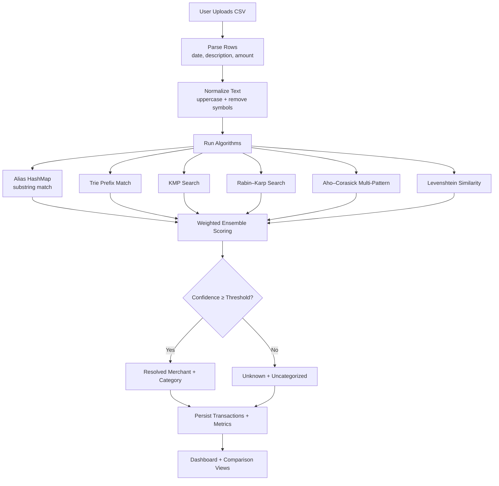

<div style="font-family: 'Times New Roman', Times, serif; font-size: 12px;">

<p style="font-size: 16px; font-weight: 700; margin: 0;">PayTrace (DAA Project) — README</p>
<p style="margin-top: 6px;">
PayTrace is a full‑stack application that resolves bank statement transaction descriptions into standardized merchant names and categories using multiple Design &amp; Analysis of Algorithms (DAA) string‑matching techniques and an ensemble scoring strategy.
</p>

<p style="font-size: 16px; font-weight: 700; margin-top: 18px; margin-bottom: 6px;">1. Chapter 1: Introduction</p>

<p style="font-size: 14px; font-weight: 700; margin: 0;">1.1 Problem Statement</p>
<p style="margin-top: 6px;">
Bank statement narrations are inconsistent (e.g., <span style="white-space: nowrap;">AMZ*2F4K20</span>,
<span style="white-space: nowrap;">AMZN MKTPLACE 883</span>). The goal is to accurately map each narration
to a canonical merchant (Amazon, Netflix, Uber, etc.) and a category (Shopping, Food, Transport, etc.).
</p>

<p style="font-size: 14px; font-weight: 700; margin: 0;">1.2 Objectives</p>
<p style="margin-top: 6px; margin-bottom: 0;">
The application is designed to:
</p>
<ol style="margin-top: 6px;">
  <li>Upload a statement CSV and parse transactions.</li>
  <li>Resolve merchants using multiple algorithms and an ensemble confidence score.</li>
  <li>Show dashboard summaries (spend/income, merchant and category breakdown).</li>
  <li>Compare algorithm performance, agreement, and (optional) accuracy against ground truth.</li>
</ol>

<p style="font-size: 16px; font-weight: 700; margin-top: 18px; margin-bottom: 6px;">2. Chapter 2: System Overview</p>

<p style="font-size: 14px; font-weight: 700; margin: 0;">2.1 Tech Stack</p>
<ul style="margin-top: 6px;">
  <li><b>Client</b>: React + Vite + Tailwind (charts via Recharts)</li>
  <li><b>Server</b>: Node.js (Express) + MongoDB (Mongoose)</li>
  <li><b>Core DAA modules</b>: Trie, KMP, Rabin–Karp, Aho–Corasick, Levenshtein similarity</li>
</ul>

<p style="font-size: 14px; font-weight: 700; margin: 0;">2.2 Repository Layout</p>
<ul style="margin-top: 6px;">
  <li><code>client/</code> — UI (dashboard, upload, aliases, comparison pages)</li>
  <li><code>server/</code> — API, persistence, merchant resolution logic</li>
</ul>

<p style="font-size: 14px; font-weight: 700; margin: 0;">2.3 How to Run</p>
<p style="margin-top: 6px; margin-bottom: 0;">Prerequisites: Node.js (v18+ recommended) and MongoDB running locally.</p>
<ol style="margin-top: 6px;">
  <li>
    Server:
    <pre style="margin-top: 6px;"><code>cd server
cp .env.example .env
npm install
npm run seed
npm run dev</code></pre>
  </li>
  <li>
    Client:
    <pre style="margin-top: 6px;"><code>cd client
cp .env.example .env
npm install
npm run dev</code></pre>
  </li>
</ol>
<p style="margin-top: 6px;">Health endpoint: <code>GET /api/health</code></p>

<p style="font-size: 16px; font-weight: 700; margin-top: 18px; margin-bottom: 6px;">3. Chapter 3: Methodology</p>

<p style="font-size: 14px; font-weight: 700; margin: 0;">3.1 Model Workflow Diagram</p>
<p style="margin-top: 6px; margin-bottom: 0;"><b>Figure 1.</b> Model workflow for statement ingestion and merchant resolution.</p>



<p style="font-size: 14px; font-weight: 700; margin: 0;">3.2 Algorithm (Ensemble Merchant Resolution)</p>
<p style="margin-top: 6px; margin-bottom: 0;">
The resolver runs multiple matching strategies and combines them into a single merchant decision by
accumulating weighted scores per merchant and selecting the top score.
</p>

<pre style="margin-top: 8px;"><code>Algorithm ResolveMerchant(description, context):
  normalized ← Normalize(description)
  scores ← empty map merchant → weightedScore

  for each algorithm Ai with weight wi:
    result ← Ai.Match(normalized, context.aliases)
    if result found:
      scores[result.merchant] += wi * result.confidence
      store per‑algorithm timing + match metadata

  top ← argmax(scores)
  if top.score &lt; threshold:
    return Unknown
  return top.merchant, category, confidence, algorithmBreakdown</code></pre>

<p style="font-size: 16px; font-weight: 700; margin-top: 18px; margin-bottom: 6px;">4. Chapter 4: Results and Discussion</p>

<p style="font-size: 14px; font-weight: 700; margin: 0;">4.1 Sample Dataset</p>
<p style="margin-top: 6px;">
This repository includes <code>server/sample-data/sample-statement.csv</code> with 18 transactions and an
<code>expectedMerchant</code> column used as ground truth for accuracy measurement.
</p>

<p style="font-size: 14px; font-weight: 700; margin: 0;">4.2 Results (Algorithm Comparison)</p>
<p style="margin-top: 6px; margin-bottom: 0;">
<b>Figure 2.</b> Results on the sample statement (18 transactions). Ensemble accuracy is <b>100%</b>, and it
detects <b>1</b> unknown transaction (the salary credit line is intentionally labeled <i>Unknown</i>).
</p>

<table style="margin-top: 10px; border-collapse: collapse; width: 100%;">
  <thead>
    <tr>
      <th style="border: 1px solid #999; padding: 6px; text-align: left;">Algorithm</th>
      <th style="border: 1px solid #999; padding: 6px; text-align: right;">Matched Txns</th>
      <th style="border: 1px solid #999; padding: 6px; text-align: right;">Avg Time (ms)</th>
      <th style="border: 1px solid #999; padding: 6px; text-align: right;">Agreement %</th>
      <th style="border: 1px solid #999; padding: 6px; text-align: right;">Accuracy %</th>
    </tr>
  </thead>
  <tbody>
    <tr><td style="border: 1px solid #999; padding: 6px;">Alias HashMap</td><td style="border: 1px solid #999; padding: 6px; text-align: right;">17</td><td style="border: 1px solid #999; padding: 6px; text-align: right;">0.0151</td><td style="border: 1px solid #999; padding: 6px; text-align: right;">100.00</td><td style="border: 1px solid #999; padding: 6px; text-align: right;">100.00</td></tr>
    <tr><td style="border: 1px solid #999; padding: 6px;">Trie Prefix</td><td style="border: 1px solid #999; padding: 6px; text-align: right;">16</td><td style="border: 1px solid #999; padding: 6px; text-align: right;">0.0253</td><td style="border: 1px solid #999; padding: 6px; text-align: right;">94.44</td><td style="border: 1px solid #999; padding: 6px; text-align: right;">94.44</td></tr>
    <tr><td style="border: 1px solid #999; padding: 6px;">KMP</td><td style="border: 1px solid #999; padding: 6px; text-align: right;">17</td><td style="border: 1px solid #999; padding: 6px; text-align: right;">0.0549</td><td style="border: 1px solid #999; padding: 6px; text-align: right;">100.00</td><td style="border: 1px solid #999; padding: 6px; text-align: right;">100.00</td></tr>
    <tr><td style="border: 1px solid #999; padding: 6px;">Rabin–Karp</td><td style="border: 1px solid #999; padding: 6px; text-align: right;">17</td><td style="border: 1px solid #999; padding: 6px; text-align: right;">0.0571</td><td style="border: 1px solid #999; padding: 6px; text-align: right;">100.00</td><td style="border: 1px solid #999; padding: 6px; text-align: right;">100.00</td></tr>
    <tr><td style="border: 1px solid #999; padding: 6px;">Aho–Corasick</td><td style="border: 1px solid #999; padding: 6px; text-align: right;">17</td><td style="border: 1px solid #999; padding: 6px; text-align: right;">0.0324</td><td style="border: 1px solid #999; padding: 6px; text-align: right;">100.00</td><td style="border: 1px solid #999; padding: 6px; text-align: right;">100.00</td></tr>
    <tr><td style="border: 1px solid #999; padding: 6px;">Levenshtein</td><td style="border: 1px solid #999; padding: 6px; text-align: right;">9</td><td style="border: 1px solid #999; padding: 6px; text-align: right;">0.6309</td><td style="border: 1px solid #999; padding: 6px; text-align: right;">55.56</td><td style="border: 1px solid #999; padding: 6px; text-align: right;">55.56</td></tr>
  </tbody>
</table>

<p style="font-size: 14px; font-weight: 700; margin: 0;">4.3 Discussion</p>
<ul style="margin-top: 6px;">
  <li>Exact/near‑exact pattern methods (Alias HashMap, KMP, Rabin–Karp, Aho–Corasick) are fast and accurate when aliases exist.</li>
  <li>Trie prefix matching can miss cases where the alias appears mid‑string, but still performs well on structured tokens.</li>
  <li>Levenshtein similarity is more expensive (O(N×M)) and is best used as a fallback for noisy descriptions.</li>
  <li>The ensemble combines signals to reduce false positives and assigns an <i>Unknown</i> label when confidence is low.</li>
</ul>

<p style="font-size: 16px; font-weight: 700; margin-top: 18px; margin-bottom: 6px;">5. Chapter 5: Conclusion</p>
<p style="margin-top: 6px;">
PayTrace demonstrates how multiple DAA string‑matching algorithms can be applied to real‑world transaction
normalization, and how an ensemble approach improves robustness by balancing speed and accuracy.
</p>

<p style="font-size: 16px; font-weight: 700; margin-top: 18px; margin-bottom: 6px;">6. Chapter 6: Code (Logic)</p>
<p style="margin-top: 6px;">
The following core logic is pasted from the repository for reference.
</p>

<details>
  <summary style="font-size: 14px; font-weight: 700;">server/src/services/resolverService.js</summary>

```js
import { performance } from "node:perf_hooks";
import Alias from "../models/Alias.js";
import Merchant from "../models/Merchant.js";
import { Trie } from "../algorithms/trie.js";
import { kmpSearch } from "../algorithms/kmp.js";
import { rabinKarpSearch } from "../algorithms/rabinKarp.js";
import { similarityScore } from "../algorithms/levenshtein.js";
import { AhoCorasick } from "../algorithms/ahoCorasick.js";

const normalizeText = (value) => (value || "").toUpperCase().replace(/[^A-Z0-9]/g, "");
const toRounded = (value) => Math.max(0, Math.min(1, Number(value.toFixed(3))));

const pickTop = (scores) => {
  const entries = Object.entries(scores);
  entries.sort((a, b) => b[1].score - a[1].score);
  if (!entries.length) return null;
  return { merchant: entries[0][0], ...entries[0][1] };
};

const addScore = (scores, merchant, category, amount, sourceAlias) => {
  if (!merchant || amount <= 0) return;
  if (!scores[merchant]) {
    scores[merchant] = { score: 0, category: category || "Uncategorized", sourceAlias };
  }
  scores[merchant].score += amount;
};

export const createResolverContext = async (userId) => {
  const [merchants, aliases] = await Promise.all([
    Merchant.find({ isActive: true }).lean(),
    Alias.find({ $or: [{ user: userId }, { user: null }] }).lean()
  ]);

  const aliasEntries = [];
  for (const merchant of merchants) {
    aliasEntries.push({
      key: normalizeText(merchant.name),
      merchantName: merchant.name,
      category: merchant.category
    });
    for (const alias of merchant.aliases || []) {
      aliasEntries.push({
        key: normalizeText(alias),
        merchantName: merchant.name,
        category: merchant.category
      });
    }
  }

  for (const alias of aliases) {
    aliasEntries.push({
      key: alias.normalizedAlias,
      merchantName: alias.merchantName,
      category: alias.category
    });
  }

  const dedup = new Map();
  aliasEntries.forEach((entry) => {
    if (!entry.key) return;
    const mapKey = `${entry.key}::${entry.merchantName}`;
    dedup.set(mapKey, entry);
  });

  const uniqueEntries = [...dedup.values()];
  const trie = new Trie();
  uniqueEntries.forEach((entry) => trie.insert(entry.key, entry));
  const aho = new AhoCorasick(uniqueEntries.map((entry) => entry.key));

  return {
    aliases: uniqueEntries,
    trie,
    aho
  };
};

const resolveWithAliasHash = (description, aliases) => {
  const normalized = normalizeText(description);
  let best = null;
  for (const alias of aliases) {
    if (!alias.key || alias.key.length < 2) continue;
    if (normalized.includes(alias.key)) {
      const score = Math.min(1, 0.9 + alias.key.length / (normalized.length + 2));
      if (!best || score > best.score) {
        best = { ...alias, score };
      }
    }
  }
  return best;
};

const resolveWithTrie = (description, trie) => {
  const normalized = normalizeText(description);
  const tokens = normalized.split(/[^A-Z0-9]+/).filter(Boolean);
  let best = null;

  const candidateTokens = [normalized, ...tokens];
  for (const token of candidateTokens) {
    const hit = trie.searchLongestPrefix(token);
    if (hit?.meta) {
      const score = Math.min(1, 0.65 + hit.prefix.length / (hit.meta.key.length + 2));
      if (!best || score > best.score) {
        best = { ...hit.meta, score };
      }
    }
  }
  return best;
};

const resolveWithPattern = (description, aliases, matcher) => {
  const normalized = normalizeText(description);
  let best = null;
  for (const alias of aliases) {
    if (!alias.key || alias.key.length < 3) continue;
    if (matcher(normalized, alias.key)) {
      const score = Math.min(1, 0.62 + alias.key.length / (normalized.length + 4));
      if (!best || score > best.score) {
        best = { ...alias, score };
      }
    }
  }
  return best;
};

const resolveWithAhoCorasick = (description, aliases, aho) => {
  const normalized = normalizeText(description);
  const aliasByKey = new Map(aliases.map((alias) => [alias.key, alias]));
  const matches = aho.search(normalized);
  let best = null;
  for (const match of matches) {
    const alias = aliasByKey.get(match.pattern);
    if (!alias) continue;
    const score = Math.min(1, 0.66 + alias.key.length / (normalized.length + 4));
    if (!best || score > best.score) {
      best = { ...alias, score };
    }
  }
  return best;
};

const resolveWithLevenshtein = (description, aliases) => {
  const normalized = normalizeText(description);
  const tokens = normalized.match(/[A-Z0-9]{2,}/g) || [];
  const candidates = [normalized, ...tokens];
  let best = null;

  for (const alias of aliases) {
    if (alias.key.length < 3) continue;
    let localBest = 0;
    for (const candidate of candidates) {
      const score = similarityScore(candidate, alias.key);
      if (score > localBest) localBest = score;
    }
    if (localBest > 0.55 && (!best || localBest > best.score)) {
      best = { ...alias, score: localBest };
    }
  }
  return best;
};

export const resolveMerchant = (description, context) => {
  const merchantScores = {};
  const algorithmBreakdown = {
    aliasHash: { merchant: "Unknown", score: 0, matched: false, timeMs: 0 },
    trie: { merchant: "Unknown", score: 0, matched: false, timeMs: 0 },
    kmp: { merchant: "Unknown", score: 0, matched: false, timeMs: 0 },
    rabinKarp: { merchant: "Unknown", score: 0, matched: false, timeMs: 0 },
    ahoCorasick: { merchant: "Unknown", score: 0, matched: false, timeMs: 0 },
    levenshtein: { merchant: "Unknown", score: 0, matched: false, timeMs: 0 }
  };

  const run = (name, fn, weight) => {
    const start = performance.now();
    const result = fn();
    const elapsed = performance.now() - start;
    algorithmBreakdown[name].timeMs = Number(elapsed.toFixed(3));
    if (result) {
      algorithmBreakdown[name] = {
        merchant: result.merchantName,
        score: toRounded(result.score),
        matched: true,
        timeMs: Number(elapsed.toFixed(3))
      };
      addScore(
        merchantScores,
        result.merchantName,
        result.category,
        toRounded(result.score * weight),
        result.key
      );
    }
  };

  run("aliasHash", () => resolveWithAliasHash(description, context.aliases), 1.0);
  run("trie", () => resolveWithTrie(description, context.trie), 0.85);
  run("kmp", () => resolveWithPattern(description, context.aliases, kmpSearch), 0.75);
  run("rabinKarp", () => resolveWithPattern(description, context.aliases, rabinKarpSearch), 0.72);
  run(
    "ahoCorasick",
    () => resolveWithAhoCorasick(description, context.aliases, context.aho),
    0.8
  );
  run("levenshtein", () => resolveWithLevenshtein(description, context.aliases), 0.7);

  const top = pickTop(merchantScores);
  if (!top || top.score < 0.56) {
    return {
      merchant: "Unknown",
      category: "Uncategorized",
      confidence: top ? toRounded(top.score) : 0.2,
      isUnknown: true,
      algorithmBreakdown
    };
  }

  return {
    merchant: top.merchant,
    category: top.category,
    confidence: toRounded(top.score),
    isUnknown: false,
    algorithmBreakdown
  };
};
```

</details>

<details>
  <summary style="font-size: 14px; font-weight: 700;">server/src/services/analysisService.js</summary>

```js
import dayjs from "dayjs";

const round2 = (value) => Number(value.toFixed(2));

export const markRecurringTransactions = (transactions) => {
  const grouped = new Map();

  for (const transaction of transactions) {
    if (transaction.isUnknown) continue;
    const amountBucket = Math.round(Math.abs(transaction.amount));
    const key = `${transaction.resolvedMerchant}::${amountBucket}`;
    if (!grouped.has(key)) grouped.set(key, []);
    grouped.get(key).push(transaction);
  }

  const recurringSummaries = [];
  for (const [key, items] of grouped.entries()) {
    if (items.length < 3) continue;
    items.sort((a, b) => new Date(a.date) - new Date(b.date));
    const intervals = [];
    for (let i = 1; i < items.length; i += 1) {
      intervals.push(dayjs(items[i].date).diff(dayjs(items[i - 1].date), "day"));
    }
    const isMonthly = intervals.every((days) => days >= 25 && days <= 35);
    const isWeekly = intervals.every((days) => days >= 6 && days <= 8);
    if (isMonthly || isWeekly) {
      items.forEach((item) => {
        item.isRecurring = true;
      });
      const [merchant] = key.split("::");
      recurringSummaries.push({
        merchant,
        amount: round2(Math.abs(items[0].amount)),
        occurrences: items.length,
        cadence: isMonthly ? "Monthly" : "Weekly"
      });
    }
  }

  return recurringSummaries;
};

export const buildDashboardData = (transactions) => {
  const merchantMap = new Map();
  const categoryMap = new Map();
  let totalSpent = 0;
  let totalIncome = 0;

  transactions.forEach((transaction) => {
    const amount = Number(transaction.amount);
    if (amount < 0) totalSpent += Math.abs(amount);
    else totalIncome += amount;

    const merchantData = merchantMap.get(transaction.resolvedMerchant) || {
      merchant: transaction.resolvedMerchant,
      amount: 0,
      count: 0,
      category: transaction.category
    };
    merchantData.amount += Math.abs(amount);
    merchantData.count += 1;
    merchantMap.set(transaction.resolvedMerchant, merchantData);

    const categoryData = categoryMap.get(transaction.category) || {
      category: transaction.category,
      amount: 0
    };
    categoryData.amount += Math.abs(amount);
    categoryMap.set(transaction.category, categoryData);
  });

  const merchantBreakdown = [...merchantMap.values()]
    .map((item) => ({
      ...item,
      amount: round2(item.amount)
    }))
    .sort((a, b) => b.amount - a.amount);
  const categoryBreakdown = [...categoryMap.values()]
    .map((item) => ({
      ...item,
      amount: round2(item.amount)
    }))
    .sort((a, b) => b.amount - a.amount);

  return {
    totals: {
      spent: round2(totalSpent),
      income: round2(totalIncome),
      net: round2(totalIncome - totalSpent)
    },
    merchantBreakdown,
    categoryBreakdown,
    unknownTransactions: transactions.filter((item) => item.isUnknown)
  };
};

const complexity = [
  { algorithm: "Alias HashMap", timeComplexity: "O(1) average lookup", spaceComplexity: "O(K)" },
  { algorithm: "Trie Prefix Match", timeComplexity: "O(L)", spaceComplexity: "O(sum of keys)" },
  { algorithm: "KMP", timeComplexity: "O(N + M)", spaceComplexity: "O(M)" },
  { algorithm: "Rabin-Karp", timeComplexity: "O(N + M) average", spaceComplexity: "O(1)" },
  {
    algorithm: "Aho-Corasick",
    timeComplexity: "O(N + matches)",
    spaceComplexity: "O(sum of keys * alphabet)"
  },
  { algorithm: "Levenshtein", timeComplexity: "O(N*M)", spaceComplexity: "O(N*M)" }
];

export const buildComparisonMetrics = (transactions) => {
  const algorithms = [
    "aliasHash",
    "trie",
    "kmp",
    "rabinKarp",
    "ahoCorasick",
    "levenshtein"
  ];
  const stats = Object.fromEntries(
    algorithms.map((algorithm) => [
      algorithm,
      { matched: 0, totalTimeMs: 0, agreement: 0, accuracyHits: 0, evaluated: 0 }
    ])
  );

  const hasGroundTruth = transactions.some((item) => item.expectedMerchant);

  for (const transaction of transactions) {
    for (const algorithm of algorithms) {
      const detail = transaction.algorithmBreakdown?.[algorithm];
      if (!detail) continue;
      if (detail.matched) stats[algorithm].matched += 1;
      stats[algorithm].totalTimeMs += detail.timeMs || 0;
      if (detail.merchant === transaction.resolvedMerchant) {
        stats[algorithm].agreement += 1;
      }
      if (hasGroundTruth && transaction.expectedMerchant) {
        stats[algorithm].evaluated += 1;
        if (detail.merchant.toLowerCase() === transaction.expectedMerchant.toLowerCase()) {
          stats[algorithm].accuracyHits += 1;
        }
      }
    }
  }

  const totalTransactions = transactions.length || 1;
  const summary = algorithms.map((algorithm) => ({
    algorithm,
    matchedTransactions: stats[algorithm].matched,
    avgTimeMs: Number((stats[algorithm].totalTimeMs / totalTransactions).toFixed(4)),
    agreementWithEnsemblePct: Number(
      ((stats[algorithm].agreement / totalTransactions) * 100).toFixed(2)
    ),
    accuracyPct:
      stats[algorithm].evaluated > 0
        ? Number(((stats[algorithm].accuracyHits / stats[algorithm].evaluated) * 100).toFixed(2))
        : null
  }));

  return {
    hasGroundTruth,
    comparisonSummary: summary,
    complexity
  };
};
```

</details>

<details>
  <summary style="font-size: 14px; font-weight: 700;">server/src/algorithms/trie.js</summary>

```js
class TrieNode {
  constructor() {
    this.children = new Map();
    this.meta = null;
  }
}

export class Trie {
  constructor() {
    this.root = new TrieNode();
  }

  insert(word, meta) {
    let node = this.root;
    for (const ch of word) {
      if (!node.children.has(ch)) node.children.set(ch, new TrieNode());
      node = node.children.get(ch);
    }
    node.meta = meta;
  }

  searchLongestPrefix(text) {
    let node = this.root;
    let longest = null;
    let prefix = "";

    for (const ch of text) {
      if (!node.children.has(ch)) break;
      node = node.children.get(ch);
      prefix += ch;
      if (node.meta) {
        longest = { prefix, meta: node.meta };
      }
    }

    return longest;
  }
}
```

</details>

<details>
  <summary style="font-size: 14px; font-weight: 700;">server/src/algorithms/kmp.js</summary>

```js
const buildLps = (pattern) => {
  const lps = Array(pattern.length).fill(0);
  let len = 0;
  let i = 1;

  while (i < pattern.length) {
    if (pattern[i] === pattern[len]) {
      len += 1;
      lps[i] = len;
      i += 1;
    } else if (len !== 0) {
      len = lps[len - 1];
    } else {
      lps[i] = 0;
      i += 1;
    }
  }

  return lps;
};

export const kmpSearch = (text, pattern) => {
  if (!pattern) return false;
  const lps = buildLps(pattern);
  let i = 0;
  let j = 0;

  while (i < text.length) {
    if (text[i] === pattern[j]) {
      i += 1;
      j += 1;
      if (j === pattern.length) return true;
    } else if (j !== 0) {
      j = lps[j - 1];
    } else {
      i += 1;
    }
  }

  return false;
};
```

</details>

<details>
  <summary style="font-size: 14px; font-weight: 700;">server/src/algorithms/rabinKarp.js</summary>

```js
export const rabinKarpSearch = (text, pattern) => {
  if (!pattern) return false;
  const prime = 101;
  const base = 256;
  const m = pattern.length;
  const n = text.length;
  if (m > n) return false;

  let patternHash = 0;
  let textHash = 0;
  let h = 1;
  for (let i = 0; i < m - 1; i += 1) h = (h * base) % prime;

  for (let i = 0; i < m; i += 1) {
    patternHash = (base * patternHash + pattern.charCodeAt(i)) % prime;
    textHash = (base * textHash + text.charCodeAt(i)) % prime;
  }

  for (let i = 0; i <= n - m; i += 1) {
    if (patternHash === textHash) {
      let match = true;
      for (let j = 0; j < m; j += 1) {
        if (text[i + j] !== pattern[j]) {
          match = false;
          break;
        }
      }
      if (match) return true;
    }

    if (i < n - m) {
      textHash = (base * (textHash - text.charCodeAt(i) * h) + text.charCodeAt(i + m)) % prime;
      if (textHash < 0) textHash += prime;
    }
  }

  return false;
};
```

</details>

<details>
  <summary style="font-size: 14px; font-weight: 700;">server/src/algorithms/ahoCorasick.js</summary>

```js
class Node {
  constructor() {
    this.children = new Map();
    this.fail = null;
    this.output = [];
  }
}

export class AhoCorasick {
  constructor(patterns) {
    this.root = new Node();
    patterns.forEach((pattern) => this.insert(pattern));
    this.buildFailures();
  }

  insert(pattern) {
    let node = this.root;
    for (const ch of pattern) {
      if (!node.children.has(ch)) node.children.set(ch, new Node());
      node = node.children.get(ch);
    }
    node.output.push(pattern);
  }

  buildFailures() {
    const queue = [];
    for (const child of this.root.children.values()) {
      child.fail = this.root;
      queue.push(child);
    }

    while (queue.length) {
      const current = queue.shift();
      for (const [ch, next] of current.children.entries()) {
        let fail = current.fail;
        while (fail && !fail.children.has(ch)) {
          fail = fail.fail;
        }
        next.fail = fail ? fail.children.get(ch) : this.root;
        next.output = [...next.output, ...next.fail.output];
        queue.push(next);
      }
    }
  }

  search(text) {
    let node = this.root;
    const matches = [];
    for (let i = 0; i < text.length; i += 1) {
      const ch = text[i];
      while (node && !node.children.has(ch)) {
        node = node.fail;
      }
      node = node ? node.children.get(ch) || this.root : this.root;
      if (node.output.length) {
        node.output.forEach((pattern) => {
          matches.push({ pattern, index: i - pattern.length + 1 });
        });
      }
    }
    return matches;
  }
}
```

</details>

<details>
  <summary style="font-size: 14px; font-weight: 700;">server/src/algorithms/levenshtein.js</summary>

```js
export const levenshteinDistance = (a, b) => {
  const dp = Array.from({ length: a.length + 1 }, () => Array(b.length + 1).fill(0));
  for (let i = 0; i <= a.length; i += 1) dp[i][0] = i;
  for (let j = 0; j <= b.length; j += 1) dp[0][j] = j;

  for (let i = 1; i <= a.length; i += 1) {
    for (let j = 1; j <= b.length; j += 1) {
      const cost = a[i - 1] === b[j - 1] ? 0 : 1;
      dp[i][j] = Math.min(
        dp[i - 1][j] + 1,
        dp[i][j - 1] + 1,
        dp[i - 1][j - 1] + cost
      );
    }
  }
  return dp[a.length][b.length];
};

export const similarityScore = (a, b) => {
  if (!a || !b) return 0;
  const distance = levenshteinDistance(a, b);
  const maxLen = Math.max(a.length, b.length);
  return maxLen === 0 ? 1 : 1 - distance / maxLen;
};
```

</details>

</div>
